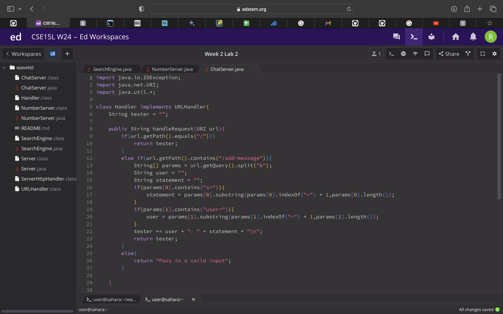
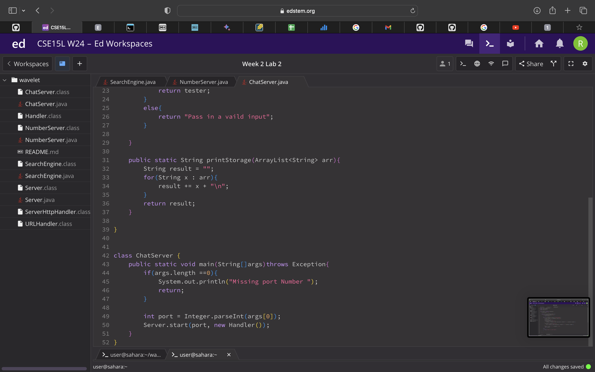
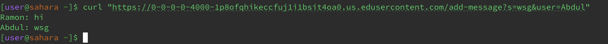
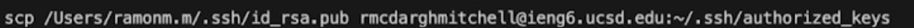
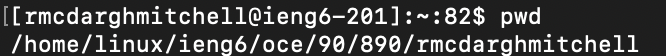
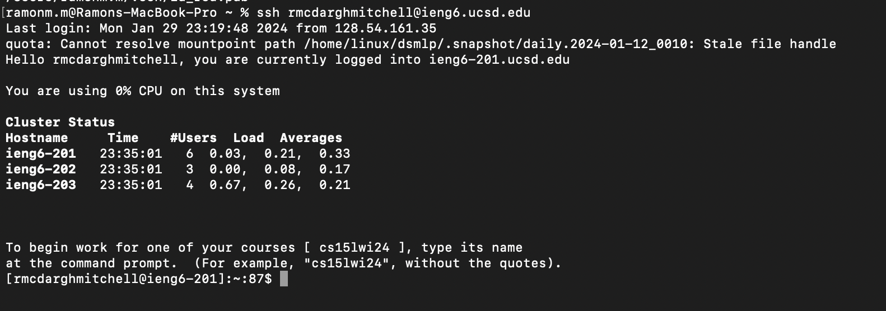

Ramon McDargh-Mitchell
PID: A17939555

# Lab Report 2

## Part 1

1. ChatServer Code

2. Screenshot one

  * The methods called in this code are `parseInt', `Server.start`, and `handleRequest(URI url)`.
  * The relevant arguemnt in `parseInt` is the `args[0]` because that is the port number used to create the server. `Server.start` has two relevant arguemnts the port number and a `new Handler()` object which is later used to edit the server page. The `handleRequest(URI url)` method has argument `URI url` which is the web server's url page so edits are made on the right page. One value of a relevant field in the `Server.start` method is `server` which is a new `HttpServer` object created in the `Server.java` class. Some values of relevant fields in the `handleRequest(URI url)` method include `tester` which starts as an empty string and `params` which is a String array used to divide and store the url query.
  * The field `server` does change from the specifc request because the server stays the same. The field `tester` does change becuase the string concatenates input from the user. Lastly the field `params` does change becuase it divides the query from user input.

3. Screenshot two
   * Methods called in this code are `parseInt', `Server.start`, and `handleRequest(URI url)`.
   * The relevant arguemnt in `parseInt` is the `args[0]` because that is the port number used to create the server. `Server.start` has two relevant arguemnts the port number and a `new Handler()` object which is later used to edit the server page. The `handleRequest(URI url)` method has argument `URI url` which is the web server's url page so edits are made on the right page. One value of a relevant field in the `Server.start` method is `server` which is a `HttpServer` object created in the `Server.java` class from when the server was first created. Some values of relevant fields in the `handleRequest(URI url)` method include `tester` which contains user input from the previous call and `params` which is a String array used to divide and store the url query.
   * The field `server` does change from the specifc request because the server stays the same. The field `tester` does change becuase the string concatenates the new input from the user. Lastly the field `params` does change becuase it divides the new query from user input.

## Part 2

1. SSH private Key absolute path
   

2. SSH public key absolute path
   

3. Log into ieng6 without password
   

## Part 3

* One thing I've learned this week was that I can use the `curl` command to transfer data over into my web server. I also learned that the `man` command allows me to lookup the use of terminal commands. Lastly, I learned the command `scp` copies files between servers.  
   
   

  
