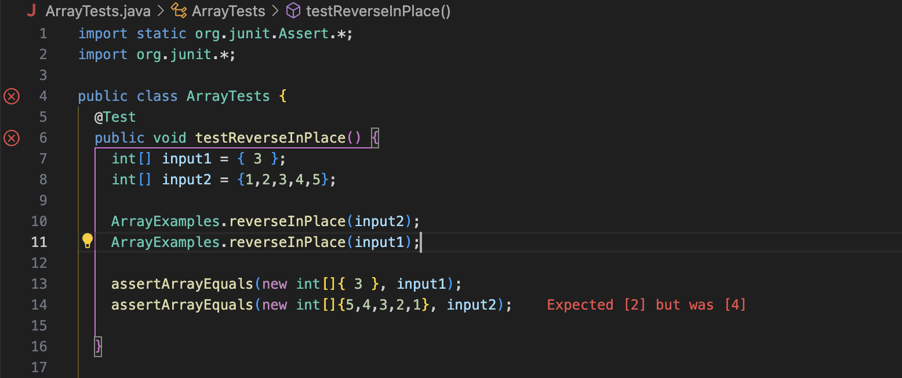

Name: Ramon McDargh-Mithcell
Email: rmcdarghmitchell@ucsd.edu
PID: A17939555

# Lab Report 3

## Part One

* Failure-Inducing Input:
  
  

  Tester Code:
  ```
  @Test 
	public void testReverseInPlace() {
    int[] input2 = {1,2,3,4,5};

    ArrayExamples.reversed(input2);
    assertArrayEquals(new int[]{5,4,3,2,1}, ArrayExamples.reversed(input2));

	}
  ```
  Algorithim:
  ```
  static void reverseInPlace(int[] arr) {
    for(int i = 0; i < arr.length; i += 1) {
      arr[i] = arr[arr.length - i - 1];
    }
  }
  ```
* No Failure-Inducing Input:
  
  

  Tester Code:
  ```
  @Test 
	public void testReverseInPlace() {
    int[] input1 = { 3 };
  
    ArrayExamples.reversed(input1);
    assertArrayEquals(new int[]{ 3 }, input1);
	}
  ```
  Algorithim:
  ```
  static void reverseInPlace(int[] arr) {
    for(int i = 0; i < arr.length; i += 1) {
      arr[i] = arr[arr.length - i - 1];
    }
  }
  ```
* The Symptoms
  
  

* The Bug Before and After
    Buggy Code 
  ```
  static void reverseInPlace(int[] arr) {
    for(int i = 0; i < arr.length; i += 1) {
      arr[i] = arr[arr.length - i - 1];
    }
  }
  ```
  Fixed Code 
  ```
  static void reverseInPlace(int[] arr) {
    for(int i = 0; i < arr.length/2; i += 1) {
      int temp = arr[i];
      arr[i] = arr[arr.length - i - 1];
      arr[arr.length - i - 1] = temp;
    }
  }
  ```
  The bug is resolved becuase I change the the for loop to iterate only half the lengh of the passed in array and replacing the value at the backend of the arry by the one in front through a temporary int variable.

## Part 2

* Example One: `find . -mtime -7`
  This command searches for files modified within the last seven days starting from current directory. This command is helpful in case 	  for determining if files were edited within seven days.
  ```
  ramonm.m@Ramons-MacBook-Pro technical % find . -mtime -7
  ramonm.m@Ramons-MacBook-Pro technical % 
  ```
* Example Two: `find biomed/ -mtime -300`
  This command for files modified within the last seven days starting from `biomed/` directory. This command is useful because it can     give us an upper bound for how long ago files in this direcotry were modified.
  ```
  ramonm.m@Ramons-MacBook-Pro technical % find biomed/ -mtime -300
  biomed/
  biomed//1472-6807-2-2.txt
  biomed//1471-2350-4-3.txt
  biomed//1471-2156-2-3.txt
  biomed//1471-2156-3-11.txt
  biomed//1471-2121-3-10.txt
  biomed//1471-2172-3-4.txt
  biomed//gb-2002-4-1-r2.txt
  biomed//gb-2003-4-6-r41.txt
  biomed//1471-2466-1-1.txt
  biomed//1471-2199-2-10.txt
  ```
* Example Three: `find . -name "plos"`
  This command finds the file name passed from current directory which is `plos/`. This is useful becuase it lets us locate files with 	  specifc names
  ```
  ramonm.m@Ramons-MacBook-Pro technical % find . -name "plos"
  ./plos
  ramonm.m@Ramons-MacBook-Pro technical %
  ```
* Example Four: `find . -name "biomed"`
  This command finds the file named passed from current directory which is `biomed/`. This command is useful because it too alows us to      find files with a certain name but instaed starting in the `biomed/` directory.
  ```
  ramonm.m@Ramons-MacBook-Pro technical % find . -name "biomed"
  ./biomed
  ramonm.m@Ramons-MacBook-Pro technical %
  ```
* Example Five: `find . -type d`
  This command finds all the directories recursively from the current directory. This command is useful because it lets us locate only       directories.
  ```
  ramonm.m@Ramons-MacBook-Pro technical % find . -type d
  .
  ./government
  ./government/About_LSC
  ./government/Env_Prot_Agen
  ./government/Alcohol_Problems
  ./government/Gen_Account_Office
  ./government/Post_Rate_Comm
  ./government/Media
  ./plos
  ./biomed
  ./911report
  ramonm.m@Ramons-MacBook-Pro technical %
  ```
* Example Six: `find . -type f`
  This command finds all the files recursively from the current directory. This command is helpful because it lets us find all files.
  ```
  ramonm.m@Ramons-MacBook-Pro technical % find . -type f
  ./government/About_LSC/LegalServCorp_v_VelazquezSyllabus.txt
  ./government/About_LSC/Progress_report.txt
  ./government/About_LSC/Strategic_report.txt
  ./government/About_LSC/Comments_on_semiannual.txt
  ./government/About_LSC/Special_report_to_congress.txt
  ./government/About_LSC/CONFIG_STANDARDS.txt
  ./government/About_LSC/commission_report.txt
  ./government/About_LSC/LegalServCorp_v_VelazquezDissent.txt
  ```
* Example Seven: `find . -size -10k`
  This command finds all files smaller than 10 kilobytes recursively from current directory. This command is useful becuase it lets us    filter out larger files.
  ```
  ramonm.m@Ramons-MacBook-Pro technical % find . -size -10k
  .
  ./government
  ./government/About_LSC
  ./government/About_LSC/LegalServCorp_v_VelazquezSyllabus.txt
  ./government/About_LSC/ODonnell_et_al_v_LSCdecision.txt
  ./government/Env_Prot_Agen
  ./government/Alcohol_Problems
  ./government/Gen_Account_Office
  ./government/Gen_Account_Office/og99036.txt
  ./government/Gen_Account_Office/og97019.txt
  ./government/Gen_Account_Office/og97020.txt
  ./government/Gen_Account_Office/og97023.txt
  ./government/Gen_Account_Office/d01121g.txt
  ```
* Example Eight: `find . -size +10k`
  This command finds all files larger than 10 kilobytes recursively from current directory. This command is useful because it locates     all files bigger than a certain 10 kilobytes.
  ```
  ramonm.m@Ramons-MacBook-Pro technical % find . -size +10k 
  ./government/About_LSC/Progress_report.txt
  ./government/About_LSC/Strategic_report.txt
  ./government/About_LSC/Comments_on_semiannual.txt
  ./government/About_LSC/Special_report_to_congress.txt
  ./government/About_LSC/CONFIG_STANDARDS.txt
  ./government/About_LSC/commission_report.txt
  ./government/About_LSC/LegalServCorp_v_VelazquezDissent.txt
  ./government/About_LSC/ONTARIO_LEGAL_AID_SERIES.txt
  ./government/About_LSC/LegalServCorp_v_VelazquezOpinion.txt
  ./government/About_LSC/diversity_priorities.txt
  ./government/About_LSC/reporting_system.txt
  ```
* Source: [Link](https://gemini.google.com/u/1/app/75c19e93ea504179)
  Prompt given: give me list of bash find commands
  Output: Gave me a list. Made no changes to it.


  
  
  
  
  

