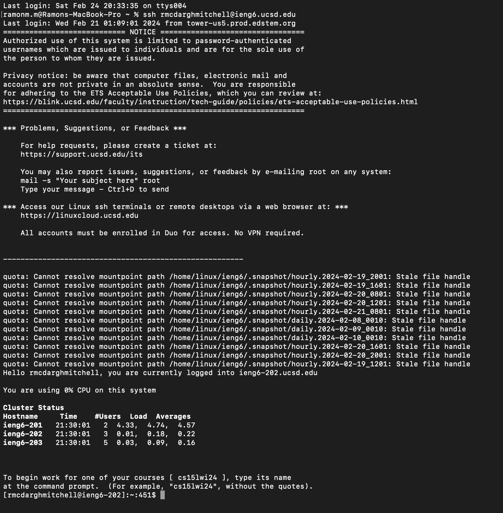
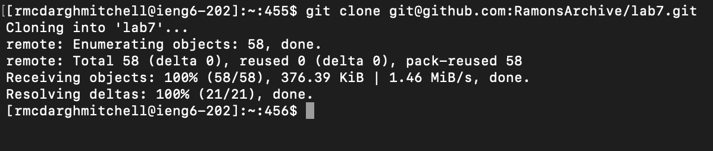
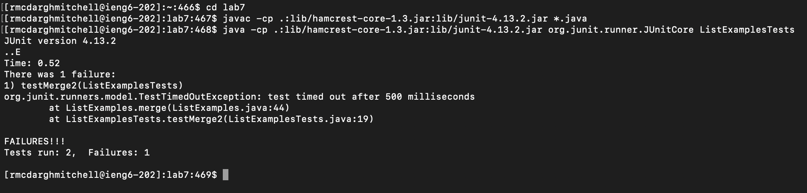
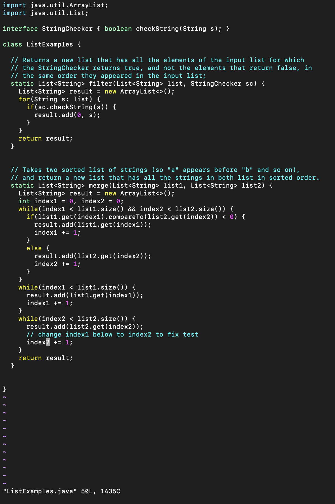
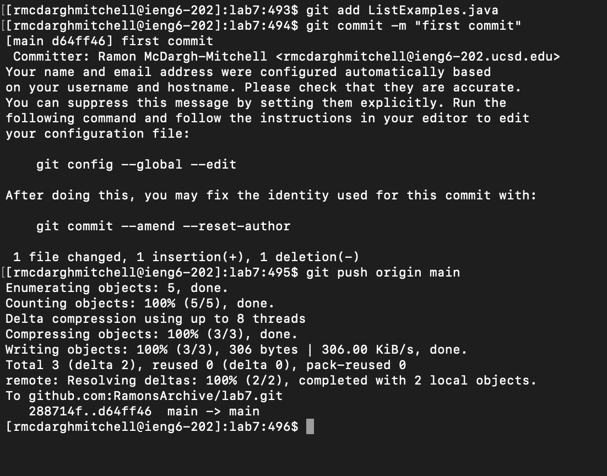

Name: Ramon McDargh-Mitchell

PID: A17939555

Email: rmcdarghmitchell@ucsd.edu

# Lab Report 4

1. Step one: Keys pressed: `ssh rmcdarghmitchell@ieng6.ucsd.edu`. This logged me into my UCSD ieng6 server.

2. Step two: Using the mouse, I pressed:`left-click`, `right-click`, `left-click`, `right-click`. Pressing these keys allowed me to copy and paste `git clone git@github.com:RamonsArchive/lab7.git`from the github repository into my terminal. This command cloned the repository from my github into my terminal.
 

3. Step three: Keys pressed: `cd lab7`,`left-click`, `right-click`, `left-click`, `right-click`, `left-click`, `right-click`, `left-click`, `right-click`. The right and left clicks enabled me to copy and paste the commands `javac -cp .:lib/hamcrest-core-1.3.jar:lib/junit-4.13.2.jar *. java` and `java -cp .:lib/hamcrest-core-1.3.jar:lib/junit-4.13.2.jar org.junit.runner.JUnitCore ListExamplesTests` into my terminal. My first command changed directories into `lab7` then my second command compiled all java files and then my last command ran all tests.

4. Step four: Keys pressed: `vim ListExamples.java`, `a <Backspace> <2> <Escape> <Shift> : w q <Escape>`. The `vim` interface put me at the correct line I wanted to edit so the first command let me edit the java file at the correct column while the rest of the key presses were the keys I pressed to fix the code, save, and exit.

5. Step five: Keys pressed: `<up> <up> <up>`, `<up> <up> <up>`. The first three up presses was to reach command `java -cp .:lib/hamcrest-core-1.3.jar:lib/junit-4.13.2.jar org.junit.runner.JUnitCore ListExamplesTests` that was three up in my command history. The second three up was to reach command `java -cp .:lib/hamcrest-core-1.3.jar:lib/junit-4.13.2.jar org.junit.runner.JUnitCore ListExamplesTests` which was three up in my command history.
.png)

6. Step six: Keys pressed: `git add ListExamples.java`, `git commit -m "first commit"`, `git push origin main`. These three commands added my edited file to the repository, commited it, then pushed my changes.

