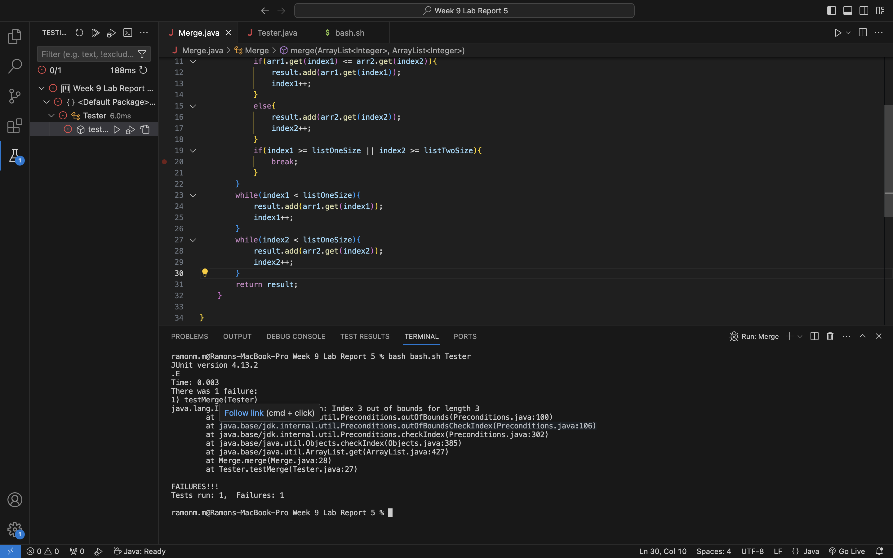
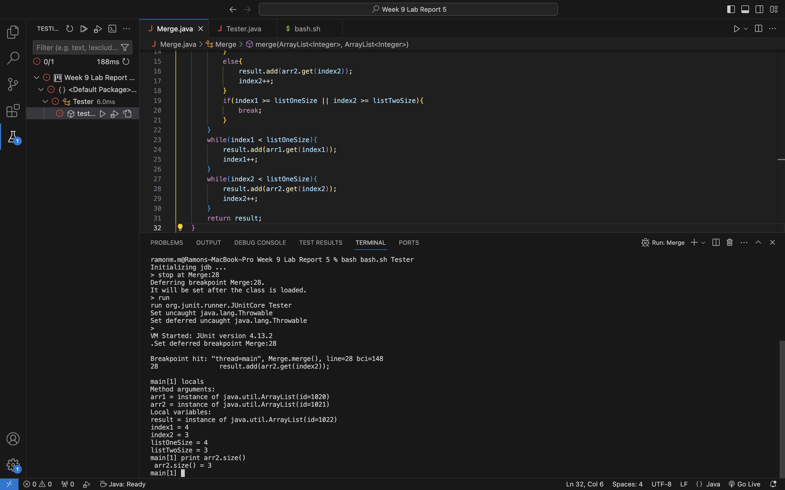

Name: Ramon McDargh-Mitchell

PID: A17939555

Email: rmcdarghmitchell@ucsd.edu

# Lab Report 5

1.
   
   Hey, I'm getting an IndexOutOfBoundsException when testing my merge method. The bug occurs at line 28 but I'm adding `arr2.get(index2)` to result and which is not at `index1` so I'm not sure what's the issue. Any help is much apprecaited. Thank you!

3. Hey there, I don't have enough information to direclty fix your error. However, I suggest you run a debugger and compare `arr2.size()` to the value of `index2`. To run the debugger, run `javac -g -cp .:lib/hamcrest-core-1.3.jar:lib/junit-4.13.2.jar *.java` and then run `jdb -classpath .:lib/hamcrest-core-1.3.jar:lib/junit-4.13.2.jar org.junit.runner.JUnitCore $1`. While in the jdb prompt, type `stop at Merge:28` where the error occurs and then type `run` to hit break point. When the break point is hit. Type `locals` to get all the local variables and then compare `index2` to `arr2.size()`. To get the size of the `arr2` and the value of `index2`, type `print arr2.size()` and `print index2`. Also look at the while loop condition to see if there is a conflict with getting the value from the array at the index when the while loop should have perhapes been terminated.  

4.
   
   The bug is that in the while loop, the condition is `index2 < listOneSize` when it should be `index2 < listTwoSize`. Because the merge method already iterated through `arr2` and copied all values to the returned ArrayList, `index2` already equals the length of `arr2` which is 3. `listOneSize` is the length of `arr1` which is 4 meaning the condition runs resulting an IndexOutOfBoundsException error.

6. All information releated to the setup
   * The absolute directory is `/Users/ramonm.m/Desktop/Year 1/CSE Classes/CSE 15L/Week 9 Lab Report 5`. The local path for all files are `Week 9 Lab Report 5/Merge.java`, `Week 9 Lab Report 5/Tester.java` and `bash.sh`.
   * Contents for `Merge.java`
     ```
     import java.util.ArrayList;

     public class Merge{
        public static ArrayList<Integer> merge(ArrayList<Integer> arr1, ArrayList<Integer> arr2){
           ArrayList<Integer> result = new ArrayList<>();
           int index1 = 0;
           int index2 = 0;
           int listOneSize = arr1.size();
           int listTwoSize = arr2.size();
           while(index1 < listOneSize && index2 < listTwoSize){
               if(arr1.get(index1) <= arr2.get(index2)){
                   result.add(arr1.get(index1));
                   index1++;
               }
               else{
                   result.add(arr2.get(index2));
                   index2++;
               }
               if(index1 >= listOneSize || index2 >= listTwoSize){
                   break;
               }
           }
           while(index1 < listOneSize){
               result.add(arr1.get(index1));
               index1++;
           }
           while(index2 < listOneSize){
               result.add(arr2.get(index2));
               index2++;
           }
           return result;
       }

      }
     ```
     Contents for `Tester.java`
     ```
     import org.junit.Before;
     import org.junit.Test;
     import java.util.ArrayList;
     import static org.junit.Assert.*;

     public class Tester {
    
       ArrayList<Integer> arr1;
       ArrayList<Integer> arr2;
       ArrayList<Integer> combined;

       @Before
       public void setUp(){
           arr1 = new ArrayList<>();
           arr1.add(2);
           arr1.add(4);
           arr1.add(3);
           arr1.add(6);
           arr2 = new ArrayList<>();
           arr2.add(1);
           arr2.add(5);
           arr2.add(3);
       }

       @Test
       public void testMerge(){ 
           ArrayList<Integer> combined = Merge.merge(arr1,arr2); // 1,2,4,3,5,3,6
           ArrayList<Integer> expected = new ArrayList<>();
           expected.add(1);
           expected.add(2);
           expected.add(4);
           expected.add(3);
           expected.add(5);
           expected.add(3);
           expected.add(6);

           assertEquals(expected, combined);
       }
    
      }
     ```
     Contents for bash.sh
     ```
     javac -cp .:lib/hamcrest-core-1.3.jar:lib/junit-4.13.2.jar *.java
      java -cp .:lib/hamcrest-core-1.3.jar:lib/junit-4.13.2.jar org.junit.runner.JUnitCore $1 
     ```
   * The command I ran to get the bug was `bash bash.sh Tester` where `Tester` is the agrument passed in for the bash script and is the name of the junit file to be tested.
   * To fix the error, I must replace `listOneSize` with `listTwoSize` in the while loop condition on line 27 because the while loop is meant to iterator over `arr2` and place any extra values not already in the returned ArrayList called `result` in it.
  
## Part 2 Reflection

1. Something cool I've learned from the second semester and didn't know of is `vim`. I find this command very intresting but more importantly useful because it allows me to edit java files from the command line. While in the `vim` interface, there are also a bunch of useful shortcuts that I appreciate because it makes using `vim` even more efficient.
     
   
