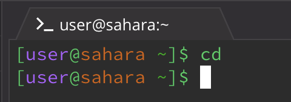

This is only the beginning.

Hello. Welcome to my blog. My name is Ramon and I am a first year at Muir college.

1. Examples using commands with no arguments

   
   
   The working directy for this command was /home
   I got this output because cd changes your directory but beceuase I had no arguemnts, no new path was printed in the terminal.
   The output is not an error because I used a proper command but failed to pass in a proper argument.

   
   
   The working directory for this command was /home
   I got this output because the ls command lists all that's in the directory which in this case is lecture1
   This output is not an error because it printed out the contents of the current directory as expected.

   
   
   The working directory for this command was /home
   I got this output because the cat command is expecting a file to read but by passing no commands, the terminal is waiting for a          proper input.
   This output is not an error because it ran and is looking for a proper argument.
    
