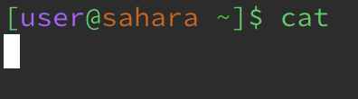

This is only the beginning.
Hello. Welcome to my blog. My name is Ramon and I am a first year at Muir college.

# Lab 1

1. **Examples using commands with no arguments**

   
   
   The working directy for this command was /home. I got this output because cd changes your directory but beceuase I had no arguemnts,     no new path was printed in the terminal. The output is not an error because the command exectured but no changes were made because I     failed to pass in a proper argument.

   
   
   The working directory for this command was /home. I got this output of lecture1 because the ls command lists all that's in the           directory which in this case is lecture1. This output is not an error because it printed out the contents of the current directory as    expected.

   
   
   The working directory for this command was /home. I got this output of nothing because the cat command is expecting a file to read       but by passing no commands, the terminal is waiting for a filename associated with the cat command. This output is not an error          because it ran and is looking for a proper argument.

2. **Examples using commands with a path to a directory as an argument**

   

   The working directory for this command was /home. I got this output of nothing but a new pointer with my changed path because the command correclty changed my directory to the one I passed as an arguemnt. This output is not an error becuase I correclty changed my directory. 

   

   The working directory for this command was /home/lecture1. I got this output of listing all the files in the messages directory becuase I passed the command ls messages/ where the exists a mesages directory to list. This output is not an error beceause it correclty lists all the contents in the messages directory I passed as my argument.

   

   The working directory for this command was /home/lecture1. I got this output telling me messages is a directory because the cat command expects a file name as an arguemnt for it to print. This output is an error because I passed a directory in place of a file name and thus the cat command can't print the contents of a directory and instead prints an error.

3. **Examples using commands with a path to a file as an argument**

   

   The working directory for this command was /home/lecture1. I got this output that the argument I passed was not a directory because the command cd is suppsed to change the directory which cannot be a file. This output is an error because I passed a file in place of a directory for me to change into thus prompting the error.

   

   The working directory for this command was /home/lecture1. I got this output of the listed directory and filename I passed as an argument because ls prints the contents of the current directory but when passed a file as an arguemnt, prints that filename and any directory passed to access that file. This output is not an error because the command correctly prints the filename and the directory leading to that file as expected when passed a file as the arguemnt.

   

   The working directory for this command was home/lecture1. I got this output of "Hello World!" because the cat command prints the message of a file passed as an argument. In this case, I passed the en-us.txt file in the messages directory as the argument. This output is not an error because the command correctly prints the contents in the file I passed as an argument.
    

      
    
